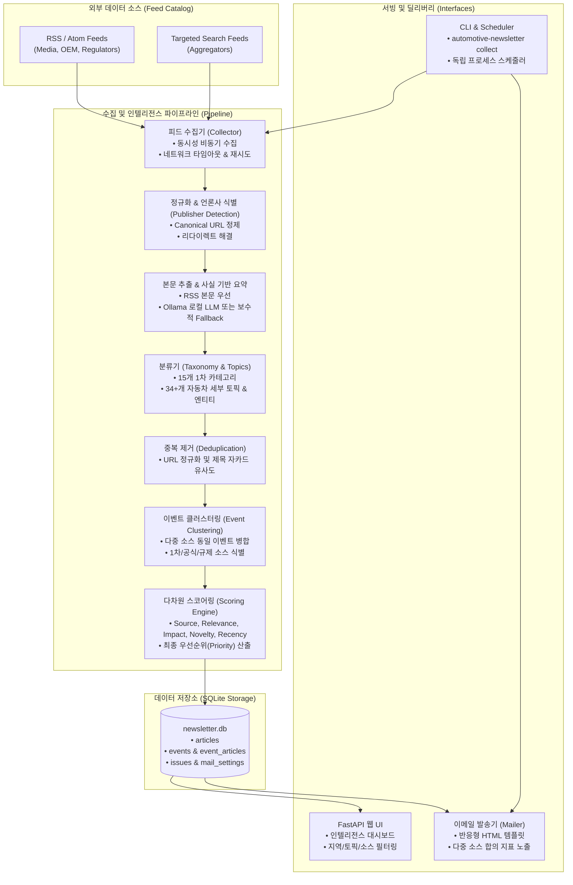
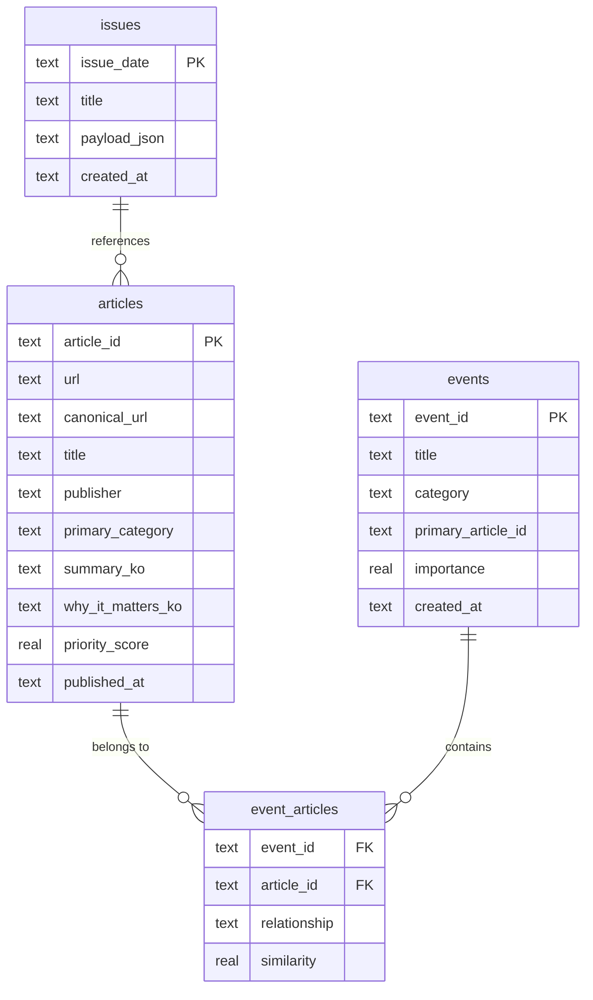

# Automotive Newsletter & Intelligence Platform

자동차 산업 및 소프트웨어 정의 차량(SDV), E/E 아키텍처, 전동화, 배터리, 규제 및 시장 동향을 매일 수집·분류·클러스터링하고, 웹 브라우저에서 인텔리전스 뷰로 탐색하며, 뉴스레터 이메일을 발송하는 프로덕션 레디(Production-Ready) 플랫폼입니다.

---

## 목차 (Table of Contents)

1. [시스템 아키텍처 (Architecture)](#1-시스템-아키텍처-architecture)
2. [데이터 파이프라인 (Data Pipeline)](#2-데이터-파이프라인-data-pipeline)
3. [소스 유형 및 권위 계층 (Source Types & Authority Hierarchy)](#3-소스-유형-및-권위-계층-source-types--authority-hierarchy)
4. [소스 카탈로그 및 피드 관리 (Source Catalog & Feed Management)](#4-소스-카탈로그-및-피드-관리-source-catalog--feed-management)
5. [신규 소스 추가 가이드 (Adding a New Source)](#5-신규-소스-추가-가이드-adding-a-new-source)
6. [기사 본문 추출 및 사실 기반 요약 파이프라인 (Summarization Pipeline)](#6-기사-본문-추출-및-사실-기반-요약-파이프라인-summarization-pipeline)
7. [로컬 LLM (Ollama) 설정 (Ollama Configuration)](#7-로컬-llm-ollama-설정-ollama-configuration)
8. [데이터베이스 스키마 및 저장소 (Database Schema & Storage)](#8-데이터베이스-스키마-및-저장소-database-schema--storage)
9. [CLI 명령어 레퍼런스 (CLI Reference)](#9-cli-명령어-레퍼런스-cli-reference)
10. [웹 서버 및 역방향 프록시 보안 (Web Server & Reverse Proxy Security)](#10-웹-서버-및-역방향-프록시-보안-web-server--reverse-proxy-security)
11. [프로덕션 스케줄링 가이드 (Production Scheduling)](#11-프로덕션-스케줄링-가이드-production-scheduling)
12. [이메일 & SMTP 설정 (Email & SMTP Configuration)](#12-이메일--smtp-설정-email--smtp-configuration)
13. [환경 변수 레퍼런스 (Environment Variables)](#13-환경-변수-레퍼런스-environment-variables)
14. [프로덕션 보안 체크리스트 (Security Checklist)](#14-프로덕션-보안-체크리스트-security-checklist)
15. [테스트 스위트 및 오프라인 검증 (Testing & Offline Fixtures)](#15-테스트-스위트-및-오프라인-검증-testing--offline-fixtures)
16. [문제 해결 및 운영 런북 (Troubleshooting & Runbook)](#16-문제-해결-및-운영-런북-troubleshooting--runbook)

---

## 1. 시스템 아키텍처 (Architecture)

본 시스템은 외부 네트워크 피드 수집부터 시작하여 분류, 이벤트 클러스터링, 다차원 스코어링, 웹 브라우저 제공 및 이메일 발송까지 유기적으로 연결된 모듈형 파이프라인으로 구성되어 있습니다.



---

## 2. 데이터 파이프라인 (Data Pipeline)

기사 수집부터 최종 서빙까지의 단계별 데이터 흐름입니다:

1. **Feed Fetching (피드 수집)**:
   - 카탈로그에 등록된 피드 URL을 비동기(`httpx`)로 가져옵니다.
   - 피드별 제한(`MAX_ENTRIES_PER_FEED`), 타임아웃(`REQUEST_TIMEOUT_SECONDS`), TLS 검증 정책을 준수합니다.
2. **Publisher Detection & Canonicalization (발행처 및 정규 URL 식별)**:
   - 추적 파라미터(`utm_*`, `ref`, `fbclid` 등)를 제거하여 `canonical_url`을 생성합니다.
   - 소스 도메인, 본문 텍스트, 저작권 문구 분석을 통해 실제 원문 발행 언론사를 역추적합니다.
3. **Content Extraction & Conservative Summarization (본문 추출 및 요약)**:
   - RSS 본문(`content:encoded`, `content`)을 최우선으로 사용하며, 필요 시 웹 스크래핑(robots.txt 준수, 빠른 타임아웃)을 시도합니다.
   - 로컬 Ollama LLM(활성화 시) 또는 규칙 기반 보수적 요약기를 통해 한국어 요약, 영문 요약, 시사점(`why_it_matters_ko`)을 생성합니다.
4. **Classification & Entity Tagging (분류 및 태깅)**:
   - 15개 1차 카테고리(`primary_category`)와 2차 카테고리를 결정합니다.
   - SDV, AUTOSAR, E/E Architecture, OTA, ADAS, 배터리 등 34개 이상의 특화 토픽과 완성차/부품사/규제 기관 엔티티를 정밀 태깅합니다.
5. **Deduplication (중복 제거)**:
   - 정규화된 URL 일치 여부와 정규화된 제목 토큰 유사도(자카드 유사도 기준 0.85 이상)를 검사하여 중복 기사를 단일 기사로 정제합니다.
6. **Event-level Clustering (이벤트 클러스터링)**:
   - 서로 다른 언론사가 동일한 현실 사건(예: 폭스바겐 구조조정 발표)을 보도한 경우, 하나의 `Event`로 묶고 소속 기사들을 `EventArticle`로 연결합니다.
   - 엔티티 겹침, 핵심 키워드 일치, 시간 윈도우(±48시간)를 계산하여 안전하게 병합합니다.
7. **Multi-dimensional Scoring (다차원 스코어링)**:
   - 출처 권위(`source_score`), SDV/E/E 관련성(`relevance_score`), 산업 파급력(`impact_score`), 참신성(`novelty_score`), 시간 감쇄(`recency_score`)를 독립 계산하여 종합 우선순위(`priority_score`)를 도출합니다.
8. **Storage & Serving (저장 및 렌더링)**:
   - SQLite 트랜잭션 내에 기사 및 이벤트 데이터를 원자적으로 보관하고, 웹 인텔리전스 대시보드와 반응형 HTML 이메일로 렌더링합니다.

---

## 3. 소스 유형 및 권위 계층 (Source Types & Authority Hierarchy)

본 시스템은 단순 RSS 어그리게이터가 아니며, 정보의 신뢰도와 1차 취재력을 차등 반영하기 위해 표준화된 소스 유형 및 권위 점수(0~100) 체계를 운용합니다.

> [!NOTE]
> 권위 점수는 정보의 절대적인 참/거짓 여부를 보증하는 것이 아니며, 정보 출처의 공식성과 1차 취재력을 기반으로 한 내부 랭킹 휴리스틱 지표입니다.

| 점수 (Authority) | 소스 분류 (Type) | 대표 소스 예시 | 설명 |
| :---: | :--- | :--- | :--- |
| **100** | `regulator` | UNECE WP.29, NHTSA, Euro NCAP, European Commission, ACEA | 정부 부처, 법정 규제 기관, 공식 표준 제정 협회 |
| **95** | `media` (와이어) | Reuters Automotive, Bloomberg Hyperdrive, AP | 사실 확인 및 원천 취재력을 갖춘 글로벌 1차 통신사 |
| **90** | `media` (전문지) | Automotive News, Automotive News Europe, Automotive World, WardsAuto, JustAuto, Automotive Dive, Automotive Logistics | 산업 전문 심층 취재 미디어 및 B2B 분석지 |
| **85** | `open_source` / `media` | Heise Autos (DE), electrive (EN/DE), ATTI, InsideEVs, Eclipse SDV, Eclipse S-CORE, COVESA, AUTOSAR | SDV 및 전동화 오픈소스 컨소시엄, 독일/유럽 특화 테크 미디어 |
| **80** | `institution` / `research` | S&P Global Mobility, McKinsey Automotive, SAE International | 글로벌 산업 조사 연구소 및 엔지니어링 학술 단체 |
| **75** | `media` (일반 테크) | TechCrunch Transportation, The Verge | 일반 테크놀로지 및 모빌리티 뉴스 매체 |
| **70** | `official` / `event` | Mercedes-Benz, BMW, VW, Bosch, Continental, ZF, 현대/기아 미디어룸 | 완성차 제조사(OEM) 및 부품사(Tier 1) 공식 보도자료룸 |
| **60** | `press_release` | PR Newswire Automotive, Business Wire | 기업 배포 상업 보도자료망 |
| **40** | `aggregator` | Google News 토픽 피드 | 다양한 웹 사이트 링크가 수집되는 검색 어그리게이터 |

---

## 4. 소스 카탈로그 및 피드 관리 (Source Catalog & Feed Management)

소스 카탈로그는 [`automotive_newsletter/sources.py`](file:///Users/CHANBAE/Documents/Automotive%20Newsletter/automotive_newsletter/sources.py)에 정의되어 있으며, 4개의 핵심 그룹으로 관리됩니다:

1. **PRIMARY (`get_primary_sources()`)**: 완성차(OEM) 및 부품사(Tier 1) 공식 뉴스룸, UNECE/NHTSA 규제기관, AUTOSAR/Eclipse SDV 표준 기구.
2. **MEDIA (`get_media_sources()`)**: Reuters, Bloomberg, Automotive News Europe, Heise Autos 등 글로벌 및 유럽 전문 저널.
3. **INSTITUTION (`get_institution_sources()`)**: ACEA, European Commission, 국제 모빌리티 컨퍼런스.
4. **AGGREGATOR (`get_aggregator_sources()`)**: 글로벌/국내 보조 검색 피드.

### 소스 메타데이터 필드 (`SourceFeed`)
- `id`: 고유 식별자 슬러그 (예: `heise_autos`, `bosch`, `unece`)
- `name`: 소스 표시명
- `bucket`: 기본 카테고리 (`sdv`, `oem`, `tier1`, `regulation`, `ev_battery` 등)
- `url`: RSS/Atom 피드 또는 타깃 검색 피드 주소
- `source_type`: 소스 분류 (`regulator`, `media`, `official`, `open_source`, `institution`, `aggregator`)
- `authority_score`: 0~100 신뢰도 지표
- `region`: `global`, `europe`, `us`, `asia`, `kr`
- `language`: 기본 언어 (`en`, `de`, `ko`)
- `catalog_group`: `primary`, `media`, `institution`, `aggregator`
- `discovery_method`: `rss`, `atom`, `search`, `manual_web`
- `enabled`: 활성화 플래그 (`True` / `False`)

---

## 5. 신규 소스 추가 가이드 (Adding a New Source)

신규 소스를 추가하려면 [`automotive_newsletter/sources.py`](file:///Users/CHANBAE/Documents/Automotive%20Newsletter/automotive_newsletter/sources.py)의 `SOURCE_CATALOG` 튜플에 `SourceFeed` 항목을 선언하면 됩니다.

### 추가 예시: Volvo Cars 공식 미디어룸 추가
```python
SourceFeed(
    id="volvo_cars",
    name="Volvo Cars Global Newsroom",
    bucket="oem",
    url="https://www.media.volvocars.com/global/en-gb/rss",
    source_type="official",
    authority_score=70,
    region="europe",
    language="en",
    catalog_group="primary",
    discovery_method="rss",
    enabled=True,
    aliases=("Volvo", "Volvo Cars"),
),
```

### 무결성 검증 및 헬스 체크
신규 소스 추가 후 다음 명령어로 카탈로그 스키마 무결성과 피드 연결 상태를 검증합니다:
```bash
# 카탈로그 무결성 및 활성 피드 목록 출력
automotive-newsletter sources

# 전체 테스트 실행하여 카탈로그 스키마 검증 통과 확인
pytest tests/test_sources.py
```

---

## 6. 기사 본문 추출 및 사실 기반 요약 파이프라인 (Summarization Pipeline)

뉴스레터 요약 엔진은 언론사 기사에서 허구의 사실(할루시네이션)을 생성하지 않도록 설계된 **엄격한 사실 기반 파이프라인**을 제공합니다.

### 1) 본문 획득 우선순위 (Extraction Priority)
1. **RSS/Atom 원문 콘텐츠**: `<content:encoded>` 또는 `<content>` 필드에 본문 전문이 포함된 경우 네트워크 부하 없이 즉시 사용.
2. **RSS 요약문**: 본문 전문이 없는 경우 피드의 `<description>` / `<summary>` 활용.
3. **온라인 본문 추출**: 위 필드가 짧고 `FETCH_ARTICLE_EXCERPTS=true`인 경우에만 제한적(robots.txt 준수, 6초 타임아웃)으로 본문 본문 블록 파싱.
4. **보수적 Fallback**: 기사 내용이 극히 짧은 경우 제목과 메타데이터에 기반한 최소 요약만 수행.

### 2) 엄격한 사실성 원칙 (Factual Guardrails)
- 본문에 명시되지 않은 **수치(숫자, 금액), 날짜, 파트너십, 경영진 결정, 기술 스펙**을 인위적으로 추측하거나 보충하지 않습니다.
- 정보가 제한된 경우 추측성 서술 대신 원문의 제한된 사실만 간결하게 기술합니다.
- 한국어 요약(`summary_ko`), 영문 요약(`summary_en`), 업계 영향(`why_it_matters_ko`), 핵심 포인트 3개(`key_points`)를 정형화하여 추출합니다.

---

## 7. 로컬 LLM (Ollama) 설정 (Ollama Configuration)

로컬 서버에 구축된 Ollama 또는 호환 인퍼런스 서버를 활용하여 외부 유출 없이 로컬 환경에서 기사를 요약할 수 있습니다.

### 1) Ollama 설치 및 모델 다운로드
```bash
# Ollama 설치 (macOS / Linux)
curl -fsSL https://ollama.com/install.sh | sh

# 추천 모델 다운로드 (경량 고성능 모델)
ollama run llama3.2
# 또는
ollama run mistral
```

### 2) 환경 변수 설정 (`.env`)
```bash
# AI 요약 활성화
ENABLE_AI_SUMMARY=true

# Ollama 엔드포인트 및 모델
OLLAMA_BASE_URL=http://localhost:11434
OLLAMA_MODEL=llama3.2
OLLAMA_TIMEOUT=30.0
```

### 3) 안정성 보장 (Graceful Fallback)
- Ollama 서버가 오프라인이거나 응답 지연(Timeout)이 발생할 경우, 파이프라인은 중단되지 않고 즉시 내장 규칙 기반(Rule-based) 요약기로 자동 전환(Fallback)되어 수집이 정상 완료됩니다.

---

## 8. 데이터베이스 스키마 및 저장소 (Database Schema & Storage)

SQLite 파일 기반 저장소(`data/newsletter.db`)를 사용하며 WAL(Write-Ahead Logging) 모드로 구동되어 동시 읽기/쓰기 충돌을 방지합니다.



### 주요 테이블
1. **`articles`**: 개별 수집 기사 메타데이터, 카테고리, 5개 차원 스코어, 요약, 정규 URL 등 저장.
2. **`events`**: 다중 소스로 보도된 복합 뉴스 이벤트 정보 및 대표 기사 ID.
3. **`event_articles`**: 이벤트와 소속 기사 간의 N:M 매핑 및 유사도.
4. **`issues`**: 일자별 최종 발행 뉴스레터 JSON 스냅샷.
5. **`mail_settings`**: SMTP 발송 설정 (비밀번호는 DB 미저장 권장).

---

## 9. CLI 명령어 레퍼런스 (CLI Reference)

설치 후 `automotive-newsletter` 콘솔 명령어를 제공합니다:

```bash
# 1. 웹 대시보드 서버 기동
automotive-newsletter serve --host 127.0.0.1 --port 8000

# 2. 오늘자 기사 수집 (타임존 적용)
automotive-newsletter collect

# 강제 재수집 (기존 당일 기사 덮어쓰기)
automotive-newsletter collect --force

# 특정 날짜 지정 수집
automotive-newsletter collect --date 2026-09-17

# 3. 단독 백그라운드 스케줄러 실행 (서버 재기동/지연 자동 보정)
automotive-newsletter schedule --time 06:00

# 4. 발행된 뉴스레터 메일 발송
automotive-newsletter send --date 2026-09-17

# 5. 등록된 소스 카탈로그 및 연결 상태 점검
automotive-newsletter sources
```

---

## 10. 웹 서버 및 역방향 프록시 보안 (Web Server & Reverse Proxy Security)

Nginx, Traefik, Caddy 등의 리버스 프록시 뒤에 배치될 때 IP 스푸핑 및 무단 관리자 접근을 차단하도록 설계되었습니다.

### 1) 신뢰 프록시 (Trusted Proxies)
- `TRUSTED_PROXIES` 및 `FORWARDED_ALLOW_IPS`를 통해 지정된 프록시의 `X-Forwarded-For` 및 `X-Forwarded-Proto` 헤더만 신뢰합니다.
- 기본값: `127.0.0.1,::1` (로컬 루프백 전용). 외부 공개 시 프록시 컨테이너의 IP 또는 서브넷을 지정하십시오.

### 2) 무상태 상수 시간 관리자 인증 (Constant-Time Admin Auth)
- 관리자 권한 API(수집 트리거, 설정 변경, 메일 발송)는 쿼리 스트링(`?admin_key=...`)을 받지 않습니다 (브라우저 히스토리, 프록시 로그 노출 방지).
- 헤더를 통해 전달해야 합니다:
  - `X-Admin-Key: <ADMIN_KEY>` 또는
  - `Authorization: Bearer <ADMIN_KEY>`
- 문자열 검증 시 `hmac.compare_digest`를 적용하여 타이밍 공격을 원천 차단합니다.

---

## 11. 프로덕션 스케줄링 가이드 (Production Scheduling)

웹 프로세스(`serve`) 내의 sleep 루프 대신, 운영체제 수준의 스케줄러를 사용하는 것이 안정적입니다.

### 방법 1: Crontab (가장 간결한 방법)
```cron
# 매일 오전 06:00 (베를린 시간 기준) 기사 수집 실행
NEWSLETTER_TIMEZONE=Europe/Berlin
0 6 * * * /app/.venv/bin/automotive-newsletter collect >> /var/log/newsletter-cron.log 2>&1
```

### 방법 2: Systemd Timer (Linux 서버)
서버 재부팅 등으로 예약 시각을 놓쳤을 때 `Persistent=true` 설정으로 부팅 직후 누락된 작업을 자동 catch-up합니다.

`/etc/systemd/system/automotive-newsletter-collect.service`:
```ini
[Unit]
Description=Automotive Newsletter Daily Collection
After=network.target

[Service]
Type=oneshot
User=appuser
WorkingDirectory=/opt/automotive-newsletter
EnvironmentFile=/opt/automotive-newsletter/.env
ExecStart=/opt/automotive-newsletter/.venv/bin/automotive-newsletter collect
```

`/etc/systemd/system/automotive-newsletter-collect.timer`:
```ini
[Unit]
Description=Run Automotive Newsletter collection daily at 06:00 Europe/Berlin

[Timer]
OnCalendar=*-*-* 06:00:00 Europe/Berlin
Persistent=true

[Install]
WantedBy=timers.target
```

```bash
sudo systemctl daemon-reload
sudo systemctl enable --now automotive-newsletter-collect.timer
```

### 방법 3: Docker Compose 분리 아키텍처
```yaml
version: '3.8'

services:
  web:
    image: automotive-newsletter:latest
    ports:
      - "127.0.0.1:8000:8000"
    volumes:
      - newsletter-data:/app/data
    environment:
      - NEWSLETTER_TIMEZONE=Europe/Berlin
      - TRUSTED_PROXIES=127.0.0.1,::1
      - FORWARDED_ALLOW_IPS=127.0.0.1,::1
      - ADMIN_KEY_FILE=/run/secrets/admin_key
      - SMTP_PASSWORD_FILE=/run/secrets/smtp_password
    secrets:
      - admin_key
      - smtp_password
    restart: unless-stopped

  scheduler:
    image: automotive-newsletter:latest
    command: ["automotive-newsletter", "schedule", "--time", "06:00"]
    volumes:
      - newsletter-data:/app/data
    environment:
      - NEWSLETTER_TIMEZONE=Europe/Berlin
    secrets:
      - admin_key
      - smtp_password
    restart: unless-stopped

volumes:
  newsletter-data:

secrets:
  admin_key:
    file: ./secrets/admin_key.txt
  smtp_password:
    file: ./secrets/smtp_password.txt
```

---

## 12. 이메일 & SMTP 설정 (Email & SMTP Configuration)

뉴스레터를 구독자에게 자동/수동 전송하기 위한 표준 SMTP 설정입니다.

```bash
SMTP_HOST=smtp.gmail.com
SMTP_PORT=587
SMTP_USER=newsletter@example.com
SMTP_PASSWORD=your-app-password
SMTP_FROM=Automotive Intelligence <newsletter@example.com>
NEWSLETTER_TO=subscribers@example.com,team@example.com
SMTP_TLS=true
```

> [!TIP]
> 웹 UI의 '설정' 탭에서 입력할 수도 있으며, 비밀번호는 보안상 웹 브라우저로 다시 반환되지 않습니다. 운영 환경에서는 환경 변수 또는 Docker Secret 파일 사용을 권장합니다.

---

## 13. 환경 변수 레퍼런스 (Environment Variables)

모든 환경 변수는 `.env` 파일 또는 시스템 환경 변수로 오버라이드할 수 있습니다.

| 변수명 | 기본값 | 설명 |
| :--- | :--- | :--- |
| `NEWSLETTER_DB_PATH` | `data/newsletter.db` | SQLite 데이터베이스 파일 경로 |
| `NEWSLETTER_TIMEZONE` | `Europe/Berlin` | 일일 수집 및 날짜 판정 기준 IANA 타임존 |
| `ADMIN_KEY` | *(None)* | 관리자 권한 API 인증 키 |
| `ADMIN_KEY_FILE` | *(None)* | 관리자 인증 키 파일 경로 (Docker Secret) |
| `TRUSTED_PROXIES` | `127.0.0.1,::1` | 신뢰할 리버스 프록시 IP 목록 (쉼표 구분) |
| `FORWARDED_ALLOW_IPS` | `127.0.0.1,::1` | Uvicorn 프록시 헤더 허용 IP |
| `DAILY_COLLECTION_TIME` | `06:00` | 일일 수집 예약 시각 (HH:MM) |
| `REQUEST_TIMEOUT_SECONDS`| `8.0` | RSS 및 웹 요청 타임아웃 (초) |
| `MAX_ENTRIES_PER_FEED` | `12` | 피드당 최대 수집 기사 수 |
| `RESOLVE_NEWS_LINKS` | `true` | Google News 등 리다이렉트 URL 원문 추적 여부 |
| `FETCH_ARTICLE_EXCERPTS`| `false` | 본문 없을 시 웹 스크래핑 시도 여부 |
| `VERIFY_TLS` | `true` | 피드 수집 시 TLS 인증서 유효성 검증 |
| `ENABLE_AI_SUMMARY` | `false` | 로컬 LLM 사실 기반 요약 파이프라인 활성화 |
| `OLLAMA_BASE_URL` | `http://localhost:11434` | Ollama API 주소 |
| `OLLAMA_MODEL` | `llama3.2` | 요약에 사용할 Ollama 모델명 |
| `OLLAMA_TIMEOUT` | `30.0` | Ollama 호출 타임아웃 (초) |
| `CONTENT_FETCH_TIMEOUT` | `6.0` | 기사 본문 개별 추출 타임아웃 (초) |
| `RECENCY_HALF_LIFE_HOURS`| `36.0` | 기사 시간 점수 감쇄 반감기 (시간 단위) |
| `SMTP_HOST` | *(None)* | 발송 SMTP 서버 호스트 |
| `SMTP_PORT` | `587` | 발송 SMTP 포트 |
| `SMTP_USER` | *(None)* | SMTP 인증 계정 |
| `SMTP_PASSWORD` | *(None)* | SMTP 인증 비밀번호 |
| `SMTP_PASSWORD_FILE` | *(None)* | SMTP 비밀번호 파일 경로 (Docker Secret) |
| `SMTP_FROM` | *(None)* | 발신자 주소 |
| `NEWSLETTER_TO` | *(None)* | 수신자 목록 (쉼표 구분) |
| `SMTP_TLS` | `true` | STARTTLS 활성화 여부 |

---

## 14. 프로덕션 보안 체크리스트 (Security Checklist)

배포 전 아래 체크리스트를 확인하십시오:

- [x] **컨테이너 Non-root 사용자**: Docker 이미지는 `appuser` (UID 10001) 권한으로 구동되어 루트 권한 탈취를 방지합니다.
- [x] **도커 헬스체크**: `Dockerfile` 내 `HEALTHCHECK --interval=30s --timeout=5s CMD curl -f http://127.0.0.1:8000/health || exit 1` 내장.
- [x] **시크릿 평문 노출 금지**: `ADMIN_KEY` 및 `SMTP_PASSWORD`는 URL 쿼리, 로그, HTML 템플릿, 에러 응답에 노출되지 않으며 Docker Secret을 지원합니다.
- [x] **프록시 헤더 위조 방지**: `TRUSTED_PROXIES`로 신뢰된 역방향 프록시 IP만 헤더를 허용합니다.
- [x] **타이밍 공격 방어**: 비밀번호 및 인증 토큰 검증 시 `hmac.compare_digest`를 사용합니다.
- [x] **네트워크 타임아웃 강제**: 모든 외부 피드 및 LLM 요청에 엄격한 타임아웃을 두어 리소스 고갈 공격을 방지합니다.

---

## 15. 테스트 스위트 및 오프라인 검증 (Testing & Offline Fixtures)

본 프로젝트는 외부 인터넷 연결 없이 100% 재현 가능한 결정론적(Deterministic) 오프라인 테스트 스위트를 갖추고 있습니다.

### 테스트 실행
```bash
# 전체 테스트 실행 (오프라인)
pytest

# 상세 출력 및 실행 시간 측정
pytest -v

# 통합 및 장애 복구 테스트만 실행
pytest tests/test_e2e_integration.py tests/test_failure_modes.py
```

### 테스트 구성
- `tests/fixtures/offline_feeds.py`: 외부 네트워크 없이 Reuters, Automotive News, Heise Autos, BMW PressClub, UNECE 등의 XML/Atom 및 결함 피드를 모킹하는 오프라인 픽스처.
- `tests/test_e2e_integration.py`: RSS 수집 → 발행처 식별 → 정규화 → 분류 → 중복 제거 → 이벤트 클러스터링 → 다차원 스코어링 → SQLite 트랜잭션 → 웹 UI 렌더링 전 과정을 엔드투엔드로 검증.
- `tests/test_failure_modes.py`: 다음 9대 장애 시나리오에 대한 무중단 회복력 검증:
  1. 피드 타임아웃 (`TimeoutException`)
  2. 잘못된 XML/파싱 에러 (`syntax error`)
  3. DNS 해석 실패 (`ConnectError`)
  4. TLS/SSL 인증서 오류 (`SSLError`)
  5. 빈 피드 (`Empty feed`)
  6. 날짜/필드가 결손된 기사 (`Malformed article`)
  7. AI 요약기 연결 실패 (`Ollama offline / timeout`)
  8. 데이터베이스 장애 (`SQLite database locked / IO error`)
  9. SMTP 전송 장애 (`SMTPConnectError / Network unreachable`)

---

## 16. 문제 해결 및 운영 런북 (Troubleshooting & Runbook)

### 1. `/health` 엔드포인트 상태 해석
- **`status: "healthy"`**: 웹 서버, 데이터베이스, 최근 수집이 모두 정상입니다.
- **`status: "degraded"`**: 웹과 DB는 정상이나, 최근 수집에서 일부 외부 피드에 일시적 실패(`feeds_failed > 0`)가 발생했습니다.
  - 조치: `automotive-newsletter sources`를 실행하여 실패한 외부 피드의 도메인 또는 네트워크 연결을 점검하십시오.

### 2. 피드 수집 시 `SSLError` 또는 `Timeout` 발생
- 원인: 특정 외신 서버의 SSL 인증서 만료 또는 방화벽 차단.
- 조치: `REQUEST_TIMEOUT_SECONDS=15`로 연장하거나, 해당 소스의 URL을 점검하십시오.

### 3. 메일 발송 실패 (`MailConfigError`)
- 원인: 잘못된 SMTP 호스트, 계정 정보, 또는 앱 비밀번호 미사용(Gmail의 경우 2차 인증 전용 앱 비밀번호 필요).
- 조치: `.env`의 `SMTP_HOST`, `SMTP_PORT`, `SMTP_PASSWORD`를 확인하고 테스트 발송을 수행하십시오.

### 4. 수집 기사가 중복으로 생성되거나 누락될 때
- `automotive-newsletter collect --force`를 실행하여 캐시된 당일 기사를 안전하게 재생성하십시오.

---

## 라이선스 (License)

MIT License.
